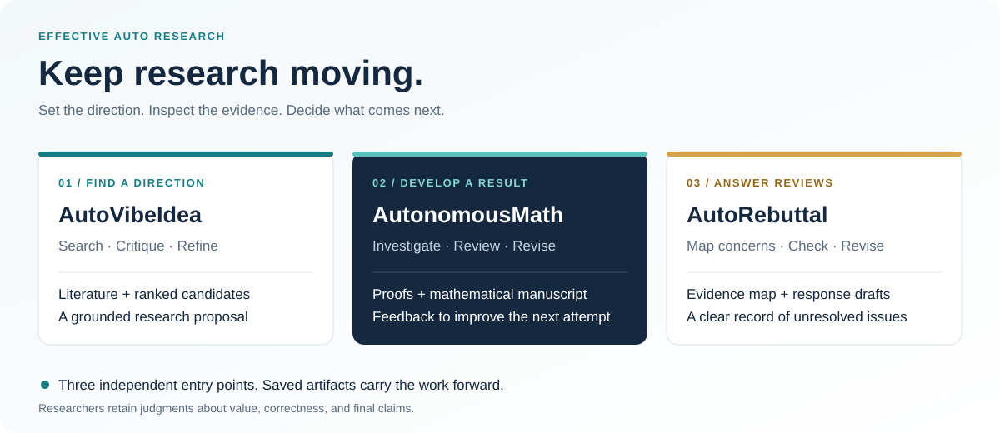
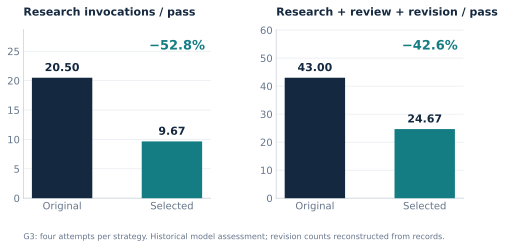

# EAR — Keep research moving.

**An open research workbench for idea discovery, mathematical research, and evidence-grounded rebuttals.**

EAR helps research agents search, attempt, review and revise while keeping the evidence behind each result. Develop a direction into a proposal, pursue a mathematical question, or turn reviewer concerns into response drafts. Choose the workflow you need; each runs independently.

[中文](README.zh-CN.md) · [Technical report](docs/technical-report/v6/reports/EAR_Technical_Report_EN.pdf) · [中文报告](docs/technical-report/v6/reports/EAR_Technical_Report_CN.pdf) · [Evidence](docs/technical-report/v6/) · [Try it](#try-ear-without-a-model-account) · [Live guide](docs/getting-started.md)



## From a research direction to inspectable work

| Start with… | Use | Get |
| --- | --- | --- |
| A direction worth exploring | [**AutoVibeIdea**](autovibeidea/) | Literature landscape, critiques, ranked candidates and a proposal draft |
| A mathematical research question | [**AutonomousMath**](autonomousmath/) | Proof attempts, a LaTeX/PDF manuscript, version-bound reviews and resumable research |
| A paper and reviewer comments | [**AutoRebuttal**](rebuttal/) | Evidence-linked reviewer responses, an AC comment and a record of unresolved concerns |

The design goal is to let researchers spend more time on direction and technical judgment. Active human-time savings have **not yet been measured**. The released observations below describe model assessments and recorded machine work.

## See what happened in real runs

### Revise the work — and improve the research strategy

AutonomousMath has two loops: the inner loop revises proofs and manuscripts from review; the outer loop compares and evolves research strategies.

| Historical observation | Result | What was compared |
| --- | --- | --- |
| Manuscript revision | **3 → 12 current-version passes** | The same 28 completed manuscripts, initial version versus round 3 |
| Strategy evolution | **52.8% fewer research calls per pass** | G3 selected strategy: 9.67 versus baseline: 20.5 calls/pass; four attempts per strategy |



These are **historical model-assessor passes**, defined as at least one Accept among three sessions, not conference acceptances. The G3 comparison is a retrospective selection batch: selected 3/4 passes versus baseline 2/4, on self-selected targets. A stricter retained-vote diagnostic gives 1/4 for both. Call counts are partial machine-work proxies, not total API cost or human time. The current portable engine uses a different terminal review gate. [Full protocol and limitations →](docs/technical-report/v6/data/protocol.json)

The full G0–G3 reporting population includes **64 attempts, 28 completed manuscripts and 15 selected-best historical passes**. The 28-manuscript revision plot is conditional on completed writing; it excludes unwritten attempts. [Inspect the revision figure](docs/technical-report/v6/figures/en/inner_progress.svg) · [Browse the aggregate tables](docs/technical-report/v6/data/README.md)

### See a research decision change

In a released idea-discovery trace, deeper literature retrieval lowered a candidate's novelty score from **8/10 to 4/10** and changed its recommendation to **ABANDON** after finding close prior work. Follow the change in the [annotated decision trace](autovibeidea/examples/judge-run/README.md). The released excerpts omit full proposals and identifying technical details. These are model judgments from one historical run, not a novelty benchmark.

[Explore all demos: report, decision trace, research loop and rebuttal wiring →](examples/README.md)

## Try EAR without a model account

**Python 3.10+ is enough** for the report demo and offline checks. Run from a complete source checkout; these commands need no GPU, API key or third-party Python package.

```bash
git clone https://github.com/liyingze07-svg/EffectiveAutoResearch-EAR-.git EAR
cd EAR

python3 -m ear demo report
python3 -m ear demo check
```

`demo report` recomputes the released aggregate metrics and checks them against the bundled result. `demo check` validates the idea example, generates five rebuttal contracts and runs a synthetic rebuttal dry-run, printing its output directory. The first verifies report arithmetic; the second verifies workflow wiring. Neither starts a live research run.

To inspect the full mathematical research loop with synthetic fixtures:

```bash
python3 -m ear math run --offline --workspace workspaces/math-demo --episodes 1
python3 -m ear math status --workspace workspaces/math-demo
```

The fixture demonstrates rejection, revision, a second review and saved artifacts. It remains labeled `offline_demo` with `accepted=false`.

## Run your own research

Live workflows use your authenticated model services. Start with the [setup guide](docs/getting-started.md) to configure Codex or Claude, workflow-specific dependencies and a workspace. Once configured:

```bash
# Research planning, with its own workspace
python3 -m ear idea --workspace workspaces/idea-01 \
  --allow-network --codex-cli "your research direction" NeurIPS

# Mathematical research, with checkpoints and terminal review
python3 -m ear math run --backend codex \
  --direction "your mathematical research question" \
  --workspace workspaces/math-01 --episodes 1

# Prepare a rebuttal case from the synthetic example, then replace its inputs
python3 -m ear rebuttal init --from-example \
  --workspace workspaces/rebuttal-01 --paper my-paper
```

The shared launcher preserves each workflow's controls. Handoffs between proposal, manuscript and rebuttal are currently manual. [Inputs, outputs and run controls →](docs/getting-started.md)

## How it works

- **Search with evidence.** AutoVibeIdea retains literature, critiques and candidate decisions so you can inspect why a direction was kept or dropped.
- **Keep research running.** AutonomousMath preserves work across episodes, develops proofs, compiles manuscripts and revises from version-bound terminal reviews. Optional evolution changes research strategies while keeping its reviewer fixed.
- **Respond from the paper.** AutoRebuttal maps concerns to evidence, drafts responses and checks persuasion and fidelity through staged review, including configurable cross-family review.

Session separation, model-family diversity and human validation provide different levels of assurance. Review routes and fallbacks are recorded. Read [architecture](docs/architecture.md) and [review and execution details](docs/operations.md) for the exact boundaries.

## Find your way around

```text
EAR/
├── ear/                  # Shared source-checkout launcher
├── autovibeidea/          # Idea discovery and proposal development
├── autonomousmath/        # Research engine, strategy evolution and dashboard
├── rebuttal/              # Response drafting and evaluation
├── docs/technical-report/v6/  # Bilingual report, figures, data and scripts
├── examples/              # Demo navigation and evidence provenance
├── docs/                  # Setup, architecture and operation
└── scripts/               # Shared environment checks and source audits
```

| I want to… | Start here |
| --- | --- |
| Run a workflow on my inputs | [Getting started](docs/getting-started.md) |
| Understand the results and their scope | [Report release](docs/technical-report/v6/README.md) |
| Explore math strategy evolution and the dashboard | [Evolution guide](autonomousmath/docs/EVOLUTION.md) |
| Understand network access, reviews and saved records | [Operations](docs/operations.md) |
| Report an issue or contribute a reproducible case | [Contributing](CONTRIBUTING.md) |

## Cite EAR

If EAR supports your research, please cite the [technical report](docs/technical-report/v6/reports/EAR_Technical_Report_EN.pdf) and identify the repository revision you used. Citation metadata is available in [CITATION.cff](CITATION.cff) and GitHub's **Cite this repository** menu.

<details>
<summary>BibTeX</summary>

```bibtex
@techreport{li2026ear,
  title       = {{EAR}: Accelerating the Research Lifecycle with Human Time as the Primary Resource},
  author      = {Li, Yingze and Wang, Dong and Wu, Ben and Liu, Xianglong and Wang, Hongzhi},
  institution = {Harbin Institute of Technology},
  year        = {2026},
  month       = oct,
  note        = {Technical report, version 6},
  url         = {https://github.com/liyingze07-svg/EffectiveAutoResearch-EAR-}
}
```

</details>

## License

[MIT](LICENSE). Copyright (c) 2026 Yingze Li, Dong Wang, Ben Wu.
