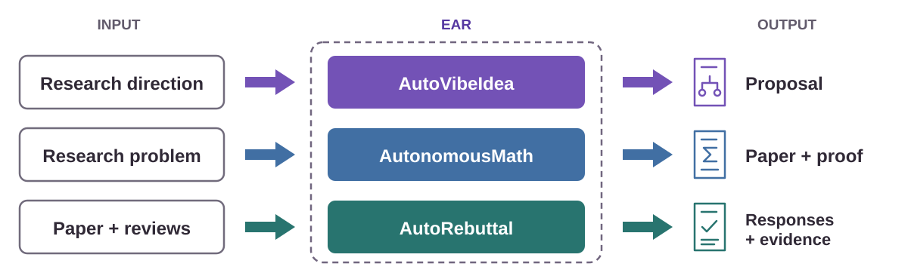
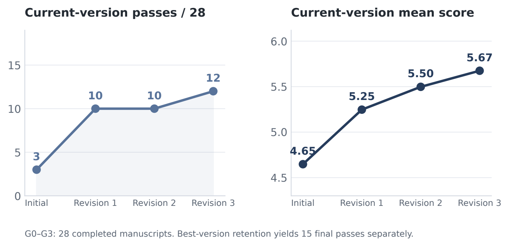
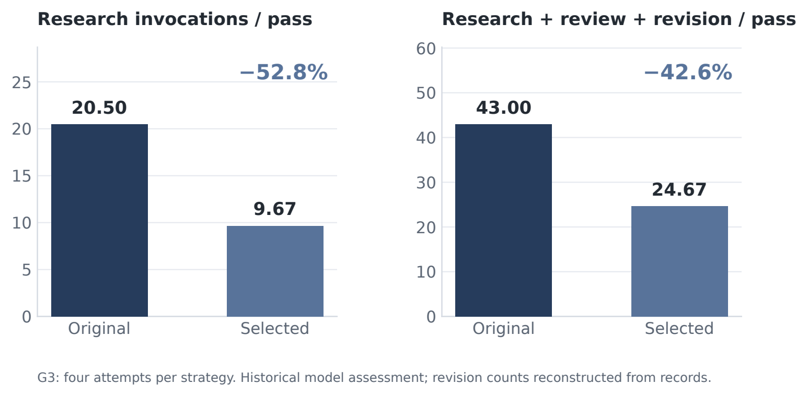
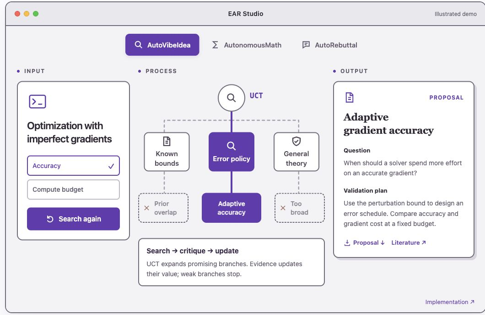
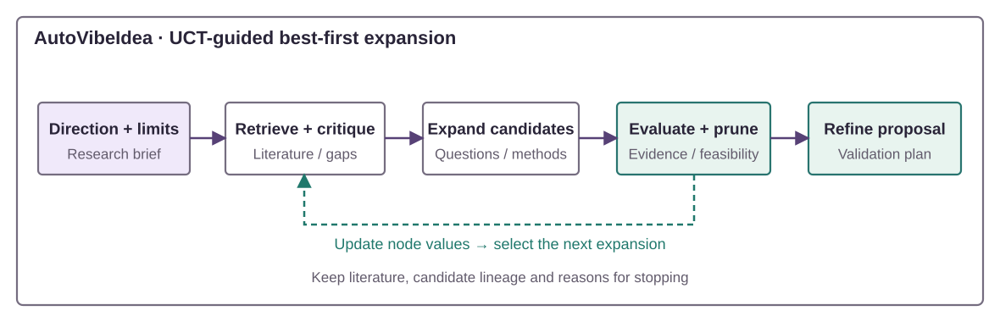
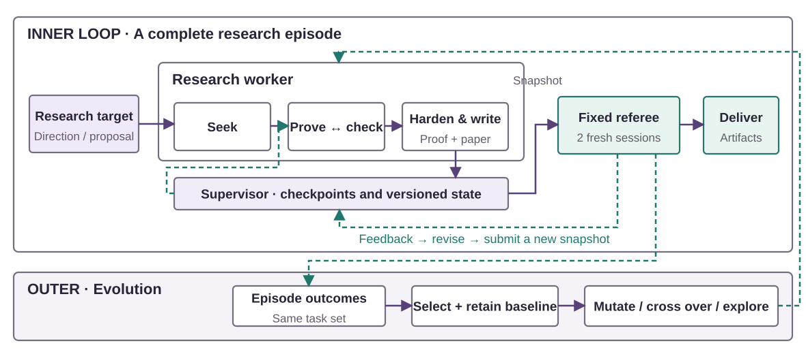
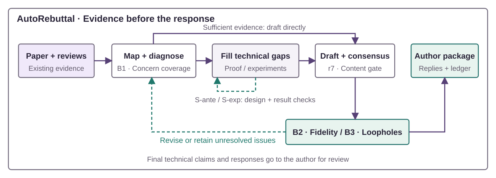

<div align="center">


<p><a href="#core-philosophy"></a></p>

<a href="docs/technical-report/v10/reports/EAR_Technical_Report_EN.pdf"></a>
<a href="https://liyingze07-svg.github.io/EffectiveAutoResearch-EAR-/"></a>
<a href="docs/getting-started.md"></a>

[中文](README.zh-CN.md) · [Examples](examples/README.md) · [Contributing](CONTRIBUTING.md)

[](https://github.com/liyingze07-svg/EffectiveAutoResearch-EAR-) [](LICENSE) [](docs/getting-started.md)

</div>

EAR combines retrieval, critique and revision to produce research proposals, mathematical manuscripts and evidence-linked reviewer responses. **The three workflows run independently.**



<a name="core-philosophy"></a>

##  Core philosophy

**Spend human time on direction and judgment.** EAR is designed to reduce active human effort subject to research-quality and compute-budget constraints.

- **Challenge ideas early.** Retrieval and critique expose overlap and help narrow a candidate before further investment.
- **Learn from feedback.** Revise the research artifact within a task; evolve the research strategy across tasks.
- **Keep the evidence.** Save literature, proofs, manuscript snapshots and reviews so the work can be inspected and continued.

<a name="modules"></a>

##  Three research modules

| Module | Start with | Deliverables |
| --- | --- | --- |
| [**AutoVibeIdea**](autovibeidea/) | A research direction and constraints | Literature landscape, ranked candidates and proposal draft |
| [**AutonomousMath**](autonomousmath/) | A mathematical question | Proof attempts, LaTeX/PDF manuscript, version-bound reviews and checkpoints |
| [**AutoRebuttal**](rebuttal/) | A paper and reviewer comments | Evidence-linked replies, AC comment and unresolved-concern ledger |

Use each module independently, with its own workspace. File handoffs between modules are currently manual.

<a name="results"></a>

##  Results and evidence

**AutonomousMath** · **64** attempts · **28** completed manuscripts · **15** selected-best historical passes.

### Manuscript revision

Current-version passes increased **3 → 12** across three revision rounds on the same 28 completed manuscripts.

[](assets/readme-figures/en/inner_progress.svg)

### Strategy evolution

In the selected G3 comparison, research calls per historical pass decreased **20.50 → 9.67 (−52.8%)**.

[](assets/readme-figures/en/cost_comparison.svg)

“Pass” means at least one Accept among three historical model-assessor sessions. The G3 comparison uses four unpaired attempts per strategy, with self-selected targets; counts cover partial machine work. Human-time savings remain unmeasured. [Report →](docs/technical-report/v10/README.md) · [Source data →](docs/technical-report/v6/data/README.md)

<details>
<summary>Full evaluation protocol · A recorded idea decision</summary>

The 28-manuscript revision comparison is conditional on completed writing and excludes unwritten attempts. Current-version passes and selected-best passes use different retention rules. The comparison does not isolate the effect of feedback from re-assessment.

The G3 batch was selected retrospectively: the selected strategy passed 3/4 attempts versus the baseline's 2/4. A stricter retained-vote diagnostic gives 1/4 for both. Invocation counts are partial work proxies, not total API cost, elapsed time or active human time. These historical model judgments do not establish conference acceptance. The current portable engine uses a different terminal review gate. [Full protocol →](docs/technical-report/v6/data/protocol.json)

In one released AutoVibeIdea trace, deeper retrieval found close prior work, lowered a candidate's novelty score **8/10 → 4/10**, and changed its recommendation to **ABANDON**. Public excerpts omit full proposals and identifying technical details. This is one historical model judgment, not a novelty benchmark. [Annotated trace →](autovibeidea/examples/judge-run/README.md)

</details>

<a name="quickstart"></a>

##  Quickstart

Launch the project page and interactive demo:

```bash
git clone https://github.com/liyingze07-svg/EffectiveAutoResearch-EAR-.git EAR
cd EAR
python3 -m ear demo studio
```

Open **<http://127.0.0.1:8765/>**. The demo needs only Python 3.10+ and its standard library—no GPU, API key or model account. English is the default; `?lang=zh` opens the Chinese counterpart.

For live research, configure authenticated Codex or Claude and module-specific dependencies using the [setup guide](docs/getting-started.md). Once the math backend is configured:

```bash
python3 -m ear math run --backend codex \
  --direction "your mathematical research question" \
  --workspace workspaces/math-01 --episodes 1
```

[Idea discovery →](docs/getting-started.md#develop-a-research-direction) · [Mathematical research →](docs/getting-started.md#pursue-a-mathematical-question) · [Reviewer responses →](docs/getting-started.md#prepare-a-rebuttal-case)

<a name="interactive-demo"></a>

##  Demo

**Explore a research process. Inspect and download its output.**



| Module | Try it in EAR Studio |
| --- | --- |
| **AutoVibeIdea** | Search the idea tree, inspect a critique and download a proposal. |
| **AutonomousMath** | Check a proof, change the error level and download the corresponding paper. |
| **AutoRebuttal** | Select a reviewer, trace the evidence and download the response. |

The demo uses authored examples; numerical checks execute locally. [Demo guide and provenance →](docs/demo-studio.md)

<details>
<summary>Export a single HTML · Run offline examples</summary>

Export the demo for a presentation or recording, then open it directly in a browser:

```bash
python3 -m ear demo studio --export workspaces/ear-demo.html
```

Recompute the released metrics and check the example workflows:

```bash
python3 -m ear demo report
python3 -m ear demo check
```

`demo report` verifies the report arithmetic; `demo check` validates the idea trace and synthetic rebuttal wiring. To exercise rejection, revision and saved math artifacts:

```bash
python3 -m ear math run --offline --workspace workspaces/math-demo --episodes 1
python3 -m ear math status --workspace workspaces/math-demo
```

The fixture remains labeled `offline_demo`, `accepted=false`. [All examples →](examples/README.md)

</details>

<a name="architecture"></a>

##  Workflow and architecture

### AutoVibeIdea · Search, critique, refine

Literature retrieval and critique update candidate values. UCT-guided expansion prioritizes promising branches; evidence and feasibility checks prune others. The retained direction becomes a proposal and validation plan.



[Search tools and proposal artifacts →](autovibeidea/)

### AutonomousMath · Revise the work, evolve the strategy

The research worker investigates, proves, checks and writes. A supervisor preserves checkpoints; a fixed referee reviews the manuscript snapshot and returns feedback for revision. The optional outer loop selects and evolves strategies while retaining the baseline and fixed reviewer.



The current terminal gate requires two fresh reviews ≥ Weak Accept. [Engine design →](autonomousmath/docs/ENGINE_DESIGN.md) · [Strategy evolution →](autonomousmath/docs/EVOLUTION.md)

### AutoRebuttal · Connect concerns to evidence

Reviewer concerns are mapped to paper evidence before drafting. Staged checks examine concern coverage, persuasion, faithfulness and wording risks. The output keeps replies, the AC comment and unresolved concerns distinct.



[Inputs, review gates and outputs →](rebuttal/) · [Execution and review routes →](docs/operations.md)

<a name="repository-structure"></a>

##  Repository structure

```text
EAR/
├── ear/                      # Shared launcher and local demo server
├── autovibeidea/              # Idea discovery and proposal development
├── autonomousmath/            # Research engine, evolution and dashboard
├── rebuttal/                  # Reviewer responses and evaluation
├── examples/                  # Interactive studio and reproducible examples
├── assets/                    # README visuals
├── docs/                      # Setup, architecture and operations
│   └── technical-report/      # v10 report and preserved v6 evidence
└── scripts/                   # Environment checks and source audits
```

<a name="documentation"></a>

##  Documentation

| Start here | What you will find |
| --- | --- |
| [Getting started](docs/getting-started.md) | Inputs, dependencies and live commands |
| [Architecture](docs/architecture.md) | Module boundaries and saved artifacts |
| [Strategy evolution](autonomousmath/docs/EVOLUTION.md) | Outer loop and research dashboard |
| [Operations](docs/operations.md) | Network access, review routes and checkpoints |
| [Report release](docs/technical-report/v10/README.md) | Bilingual PDF, data and recomputation |

<a name="contributing"></a>

##  Contributing

Bug reports, reproducible cases and focused improvements are welcome. Read [CONTRIBUTING.md](CONTRIBUTING.md) for checks and pull request guidance, or [open an issue](https://github.com/liyingze07-svg/EffectiveAutoResearch-EAR-/issues).

<a name="citation"></a>

##  Citation

If EAR supports your research, cite the technical report and record the repository revision you used. GitHub's **Cite this repository** menu reads [CITATION.cff](CITATION.cff).

```bibtex
@techreport{li2026ear,
  title       = {{EAR}: Advance research through feedback. Improve strategies through results.},
  author      = {Li, Yingze and Wang, Dong and Wu, Ben and Liu, Xianglong and Wang, Hongzhi},
  institution = {Harbin Institute of Technology},
  year        = {2026},
  month       = oct,
  note        = {Technical report, version 10},
  url         = {https://github.com/liyingze07-svg/EffectiveAutoResearch-EAR-}
}
```

[MIT License](LICENSE) · Copyright (c) 2026 Yingze Li, Dong Wang, Ben Wu.
