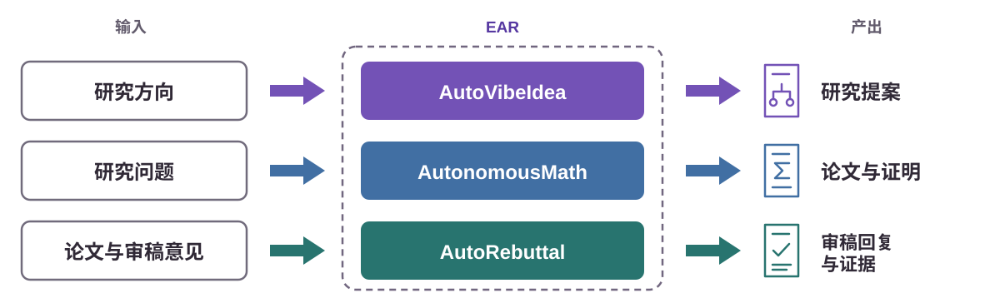
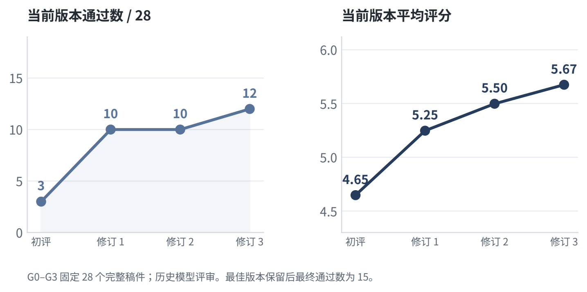
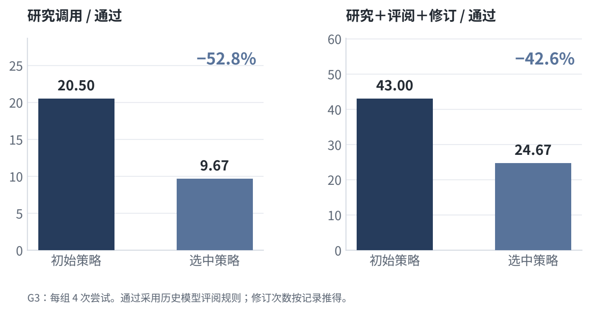
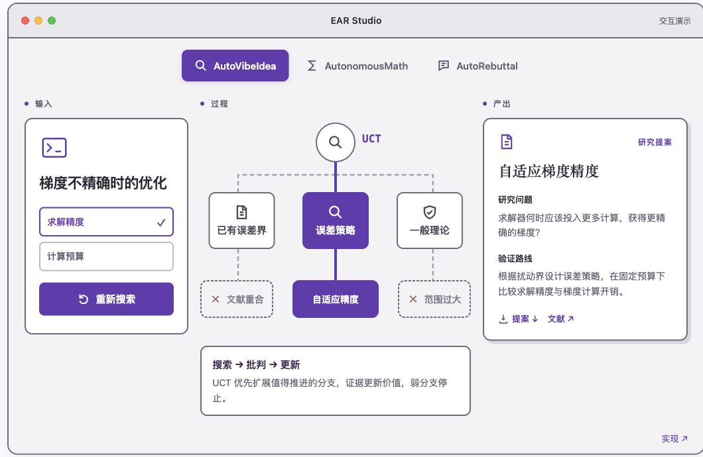
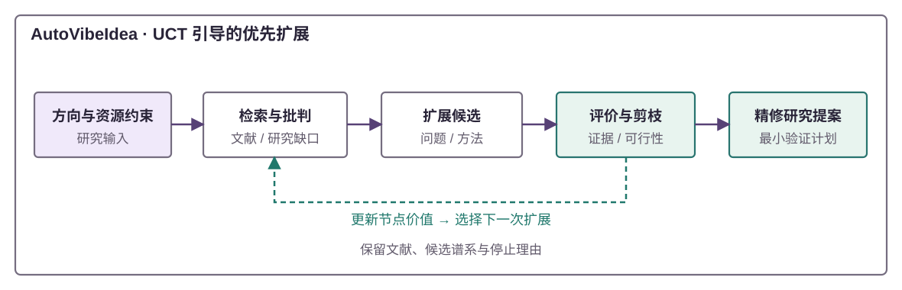
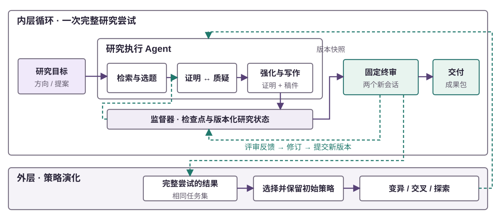
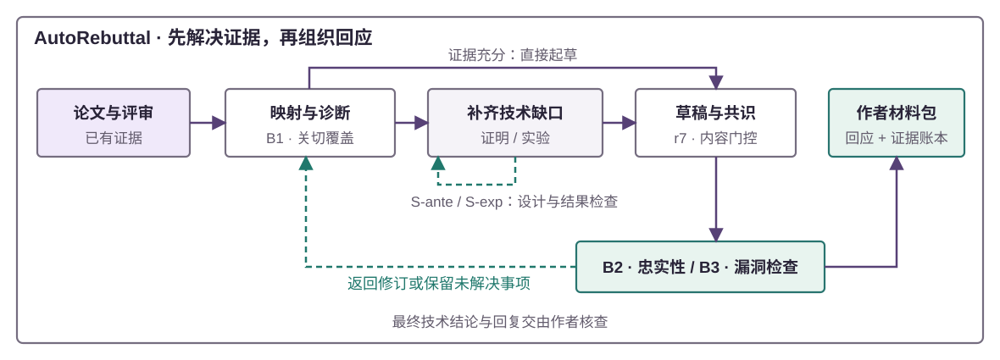

<div align="center">


<p><a href="#core-philosophy"></a></p>

<a href="docs/technical-report/v10/reports/EAR_Technical_Report_CN.pdf"></a>
<a href="https://liyingze07-svg.github.io/EffectiveAutoResearch-EAR-/?lang=zh"></a>
<a href="docs/getting-started.md"></a>

[English](README.md) · [示例](examples/README.md) · [参与贡献](CONTRIBUTING.md)

[](https://github.com/liyingze07-svg/EffectiveAutoResearch-EAR-) [](LICENSE) [](docs/getting-started.md)

</div>

EAR 将检索、批判与修订用于研究提案、数学稿件和有证据支撑的审稿回复。**三个工作流可以独立使用。**



<a name="core-philosophy"></a>

##  核心理念

**把人的时间留给方向选择与研究判断。** EAR 的设计目标是在研究质量与计算预算约束下，减少研究者的主动投入时间。

- **先质疑，再投入。** 检索与批判揭示已有工作的重叠，帮助收窄候选选题。
- **让反馈改变下一步。** 在任务内修订研究成果，在任务之间演化研究策略。
- **保留研究依据。** 保存文献、证明、稿件版本与评审，让已有工作可以检查和接续。

<a name="modules"></a>

##  三个研究模块

| 模块 | 输入 | 产出 |
| --- | --- | --- |
| [**AutoVibeIdea**](autovibeidea/) | 研究方向与约束 | 文献图景、候选排序与研究提案 |
| [**AutonomousMath**](autonomousmath/) | 数学研究问题 | 证明尝试、LaTeX/PDF 稿件、绑定版本的评审与检查点 |
| [**AutoRebuttal**](rebuttal/) | 论文与审稿意见 | 有证据支撑的回复、AC 说明与未解决问题记录 |

各模块可独立使用，采用各自的工作目录；目前需要人工交接文件。

<a name="results"></a>

##  结果与证据

**AutonomousMath** · **64** 次尝试 · **28** 篇完成稿件 · **15** 篇所选最佳版本历史通过稿件。

### 稿件修订

固定 28 篇完成稿件，经过三轮修订，当前版本通过数 **3 → 12**。

[](assets/readme-figures/cn/inner_progress.svg)

### 策略演化

G3 所选比较中，每篇历史通过稿件的研究调用数 **20.50 → 9.67，下降 52.8%**。

[](assets/readme-figures/cn/cost_comparison.svg)

“通过”指三个历史模型评估会话中至少一个给出 Accept。G3 每个策略各尝试 4 次，目标自行选择、未配对；调用数仅覆盖部分机器工作量。人的工作时间节省尚未测量。[技术报告 →](docs/technical-report/v10/README.md) · [原始汇总数据 →](docs/technical-report/v6/data/README.md)

<details>
<summary>完整评估口径 · 一次选题决策记录</summary>

28 篇稿件的修订比较以完成写作为前提，不包含未写成的尝试。当前版本与所选最佳版本采用不同的保留规则；该比较没有单独区分反馈修订与重新评估的影响。

G3 批次由事后选择：所选策略通过 3/4，对照通过 2/4；更严格的保留票诊断中，两者均为 1/4。调用数不等于全部 API 费用、耗时或人的主动工作时间。历史模型评估不代表会议录用，当前便携引擎采用另一套终审规则。[完整协议 →](docs/technical-report/v6/data/protocol.json)

一次公开的 AutoVibeIdea 记录中，深入检索发现了近邻工作，使候选的新颖性评分 **8/10 → 4/10**，建议变为 **ABANDON（放弃）**。公开节选省略完整提案与可识别的技术细节；这是一次历史模型判断，不是新颖性评估基准。[查看决策记录 →](autovibeidea/examples/judge-run/README.md)

</details>

<a name="quickstart"></a>

##  快速开始

启动项目主页与交互 Demo：

```bash
git clone https://github.com/liyingze07-svg/EffectiveAutoResearch-EAR-.git EAR
cd EAR
python3 -m ear demo studio
```

打开 **<http://127.0.0.1:8765/>**。Demo 只需 Python 3.10+ 与标准库，无需 GPU、API Key 或模型账户。默认英文，`?lang=zh` 切换到中文。

在线研究需要按[入门指南](docs/getting-started.md)配置已认证的 Codex 或 Claude 与模块依赖。配置数学研究后端后，例如运行：

```bash
python3 -m ear math run --backend codex \
  --direction "你的数学研究问题" \
  --workspace workspaces/math-01 --episodes 1
```

[选题探索 →](docs/getting-started.md#develop-a-research-direction) · [数学研究 →](docs/getting-started.md#pursue-a-mathematical-question) · [审稿回复 →](docs/getting-started.md#prepare-a-rebuttal-case)

<a name="interactive-demo"></a>

##  Demo

**参与研究过程，检查并下载成果。**



| 模块 | 在 EAR Studio 中体验 |
| --- | --- |
| **AutoVibeIdea** | 搜索选题树、检查批判意见、下载研究提案。 |
| **AutonomousMath** | 检查证明、调整误差参数、下载对应论文。 |
| **AutoRebuttal** | 选择审稿人、追溯证据、下载回复。 |

Demo 使用编写的示例，数值检查在本地实际执行。[演示指南与材料来源 →](docs/demo-studio.md)

<details>
<summary>导出单个 HTML · 运行离线示例</summary>

会议或录屏时，导出 Demo 后可直接在浏览器打开：

```bash
python3 -m ear demo studio --export workspaces/ear-demo.html
```

复算公开指标，检查示例工作流：

```bash
python3 -m ear demo report
python3 -m ear demo check
```

`demo report` 验证报告数字，`demo check` 验证选题记录与模拟回复的流程衔接。还可以检查数学研究的拒绝、修订与产物保存：

```bash
python3 -m ear math run --offline --workspace workspaces/math-demo --episodes 1
python3 -m ear math status --workspace workspaces/math-demo
```

数学示例保留 `offline_demo` 与 `accepted=false` 标记。[全部示例 →](examples/README.md)

</details>

<a name="architecture"></a>

##  工作流程与原理

### AutoVibeIdea · 搜索、批判、完善

文献检索与批判更新候选价值。UCT 引导搜索优先扩展有希望的分支，证据与可行性检查剪掉其他分支，保留的方向形成研究提案与验证路线。



[搜索工具与提案产物 →](autovibeidea/)

### AutonomousMath · 修订成果，演化策略

研究工作器负责探索、证明、检查与写作，监督器保存检查点，固定评审器对稿件快照给出反馈并推动修订。可选外循环保留对照与固定评审器，选择和演化研究策略。



当前终审要求两个新会话的评审均 ≥ Weak Accept。[引擎设计 →](autonomousmath/docs/ENGINE_DESIGN.md) · [策略演化 →](autonomousmath/docs/EVOLUTION.md)

### AutoRebuttal · 让关切与证据对应

先将审稿关切与论文证据对应，再起草回复。分阶段检查覆盖关切、说服力、忠实性与措辞风险；审稿人回复、AC 说明与未解决问题分别保留。



[输入、评审关卡与产出 →](rebuttal/) · [运行与评审路径 →](docs/operations.md)

<a name="repository-structure"></a>

##  目录结构

```text
EAR/
├── ear/                      # 统一入口与本地 Demo 服务
├── autovibeidea/              # 选题探索与研究提案
├── autonomousmath/            # 研究引擎、策略演化与控制面板
├── rebuttal/                  # 审稿回复与评估
├── examples/                  # 交互 Studio 与可复现示例
├── assets/                    # README 视觉素材
├── docs/                      # 入门、架构与运行说明
│   └── technical-report/      # v10 报告与保留的 v6 证据
└── scripts/                   # 环境与源码检查
```

<a name="documentation"></a>

##  文档导航

| 从这里开始 | 内容 |
| --- | --- |
| [入门指南](docs/getting-started.md) | 输入、依赖与在线运行命令 |
| [架构说明](docs/architecture.md) | 模块边界与产物保存 |
| [策略演化](autonomousmath/docs/EVOLUTION.md) | 外层循环与研究控制面板 |
| [运行说明](docs/operations.md) | 网络访问、评审路径与检查点 |
| [报告发布包](docs/technical-report/v10/README.md) | 双语 PDF、数据与复算 |

<a name="contributing"></a>

##  参与贡献

欢迎提交问题、可复现案例与聚焦的改进。检查要求与 PR 说明见 [CONTRIBUTING.md](CONTRIBUTING.md)，也可以[创建 Issue](https://github.com/liyingze07-svg/EffectiveAutoResearch-EAR-/issues)。

<a name="citation"></a>

##  引用

如果 EAR 帮助了你的研究，请引用技术报告并记录使用的仓库版本。GitHub 的 **Cite this repository** 菜单读取 [CITATION.cff](CITATION.cff)。

```bibtex
@techreport{li2026ear,
  title       = {{EAR}: Advance research through feedback. Improve strategies through results.},
  author      = {Li, Yingze and Wang, Dong and Wu, Ben and Liu, Xianglong and Wang, Hongzhi},
  institution = {Harbin Institute of Technology},
  year        = {2026},
  month       = oct,
  note        = {Technical report, version 10},
  url         = {https://github.com/liyingze07-svg/EffectiveAutoResearch-EAR-}
}
```

[MIT 许可证](LICENSE) · Copyright (c) 2026 Yingze Li, Dong Wang, Ben Wu。
