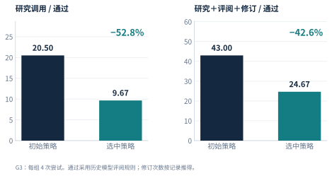

# EAR — 让研究持续推进

**面向研究选题、数学研究与审稿回复的开源研究工作台。**

EAR 让研究 Agent 持续检索、尝试、评审和修订，并保留每次结果背后的证据。把一个方向发展成研究提案，围绕数学问题推进证明和写作，或根据论文证据回应审稿意见。三个工作流可以独立使用。

[English](README.md) · [中文报告](docs/technical-report/v6/reports/EAR_Technical_Report_CN.pdf) · [Technical report](docs/technical-report/v6/reports/EAR_Technical_Report_EN.pdf) · [公开证据](docs/technical-report/v6/) · [立即体验](#无需模型账户即可体验) · [在线运行指南](docs/getting-started.md)


## 从研究输入，到可以检查的成果

| 你手上有什么 | 选择工作流 | 得到什么 |
| --- | --- | --- |
| 一个值得探索的研究方向 | [**AutoVibeIdea**](autovibeidea/) | 文献图景、批判分析、候选排序与提案草稿 |
| 一个数学研究问题 | [**AutonomousMath**](autonomousmath/) | 证明尝试、LaTeX/PDF 稿件、绑定版本的评审与可续跑的研究记录 |
| 论文与审稿意见 | [**AutoRebuttal**](rebuttal/) | 有证据支撑的审稿人回复、AC 说明与未解决问题记录 |

设计目标是让研究者把更多时间用于方向选择和技术判断。**目前尚未测量节省了多少人的主动工作时间**；以下公开结果衡量模型评估和已记录的机器工作量。

## 看看真实运行中发生了什么

### 修改研究成果，也改进研究策略

AutonomousMath 包含两个循环：内循环根据评审修订证明和稿件；外循环比较、选择并演化研究策略。

| 历史观察 | 结果 | 比较口径 |
| --- | --- | --- |
| 稿件持续修订 | **当前版本通过数 3 → 12** | 固定的 28 篇已完成稿件，初始版本与第 3 轮相比 |
| 研究策略演化 | **每篇通过稿件的研究调用数减少 52.8%** | G3 所选策略 9.67 次，对照 20.5 次；每个策略各尝试 4 次 |



这里的“通过”指**历史模型评估通过**：三个会话中至少一个给出 Accept，不代表会议录用。G3 是事后选出的比较批次：所选策略通过 3/4，对照通过 2/4，研究目标由各策略自行寻找；采用更严格的保留票诊断时，两者均为 1/4。调用数只覆盖部分机器工作量，不等于全部 API 费用或人的工作时间。当前便携引擎使用另一套终审规则。[完整协议与限制 →](docs/technical-report/v6/data/protocol.json)

G0–G3 全体统计包含 **64 次尝试、28 篇完成稿件、15 篇历史所选最佳版本通过稿件**。28 篇的修订轨迹以完成写作为前提，不包含未写成稿件的尝试。[查看修订图](docs/technical-report/v6/figures/cn/inner_progress.svg) · [查看汇总数据](docs/technical-report/v6/data/README.md)

### 看一次研究判断如何改变

公开的选题记录中，第二轮深入检索发现了近邻工作，使一个候选的新颖性评分从 **8/10 降到 4/10**，建议变为 **ABANDON（放弃）**。[查看删节后的决策记录](autovibeidea/examples/judge-run/README.md)。公开节选省略了完整提案与可识别的技术细节。这是一次历史运行的模型判断，不是新颖性评估基准。

[浏览全部 Demo：报告复算、判断变化、研究内循环与回复流程 →](examples/README.md)

## 无需模型账户即可体验

报告演示与离线检查只需 **Python 3.10+**。从完整源码目录运行即可，无需 GPU、API Key 或第三方 Python 包。

```bash
git clone https://github.com/liyingze07-svg/EffectiveAutoResearch-EAR-.git EAR
cd EAR

python3 -m ear demo report
python3 -m ear demo check
```

`demo report` 从公开汇总表重算指标，并与随包结果核对。`demo check` 验证选题样例、生成五份回复契约、执行模拟回复 dry-run，并打印产物目录。前者验证报告数字的复算，后者验证流程衔接；两者均不会启动在线研究。

还可以用模拟数据走完数学研究内循环：

```bash
python3 -m ear math run --offline --workspace workspaces/math-demo --episodes 1
python3 -m ear math status --workspace workspaces/math-demo
```

该演示展示首次拒绝、反馈修订、再次评审和产物保存。结果保留 `offline_demo` 标记与 `accepted=false`，不会计为真实研究通过。

## 运行你自己的研究

在线工作流使用你已经认证的模型服务。先按[入门指南](docs/getting-started.md) 配置 Codex 或 Claude、对应依赖和工作目录，再运行：

```bash
# 为选题任务创建独立工作目录
python3 -m ear idea --workspace workspaces/idea-01 \
  --allow-network --codex-cli "你的研究方向" NeurIPS

# 数学研究：保留检查点，并执行终审
python3 -m ear math run --backend codex \
  --direction "你的数学研究问题" \
  --workspace workspaces/math-01 --episodes 1

# 从模拟样例初始化回复案例，再替换为自己的论文和意见
python3 -m ear rebuttal init --from-example \
  --workspace workspaces/rebuttal-01 --paper my-paper
```

统一入口保留各工作流原有控制能力。提案、论文与审稿回复之间目前仍需人工交接文件。[输入、输出与任务控制 →](docs/getting-started.md)

## 它如何工作

- **用证据推进选题。** AutoVibeIdea 保存文献、批判分析和候选处理记录，帮助你检查一个方向为什么被保留或放弃。
- **持续推进研究。** AutonomousMath 跨研究轮次保存状态，发展证明、编译稿件，并根据绑定版本的终审继续修订；可选的演化模块在保持评审器固定的情况下调整研究策略。
- **围绕论文回应。** AutoRebuttal 将审稿疑虑与证据对应，起草回复，再通过分阶段评审检查说服力与忠实性，支持配置跨模型家族评审。

独立会话、不同模型家族和人工验证提供不同层面的检查。实际评审路径和降级情况保存在记录中。细节见[架构说明](docs/architecture.md)与[运行及评审说明](docs/operations.md)。

## 项目导航

```text
EAR/
├── ear/                  # 源码工作目录下的统一入口
├── autovibeidea/          # 选题与提案
├── autonomousmath/        # 研究引擎、策略演化与控制面板
├── rebuttal/              # 审稿回复与评估
├── docs/technical-report/v6/  # 双语报告、图、数据与复算脚本
├── examples/              # Demo 导航与证据来源
├── docs/                  # 入门、架构与运行说明
└── scripts/               # 共享环境检查与源码检查
```

| 我想…… | 从这里开始 |
| --- | --- |
| 替换为自己的输入 | [入门指南](docs/getting-started.md) |
| 理解报告结果与适用范围 | [报告发布包](docs/technical-report/v6/README.md) |
| 试用策略演化和控制面板 | [演化指南](autonomousmath/docs/EVOLUTION.md) |
| 了解网络访问、评审与记录保存 | [运行说明](docs/operations.md) |
| 反馈问题或贡献可复现案例 | [参与贡献](CONTRIBUTING.md) |

## 引用 EAR

如果 EAR 帮助了你的研究，欢迎引用[技术报告](docs/technical-report/v6/reports/EAR_Technical_Report_CN.pdf)，并注明使用的仓库版本。引用元数据见 [CITATION.cff](CITATION.cff)，也可使用 GitHub 的 **Cite this repository** 菜单。

<details>
<summary>复制 BibTeX</summary>

```bibtex
@techreport{li2026ear,
  title       = {{EAR}: Accelerating the Research Lifecycle with Human Time as the Primary Resource},
  author      = {Li, Yingze and Wang, Dong and Wu, Ben and Liu, Xianglong and Wang, Hongzhi},
  institution = {Harbin Institute of Technology},
  year        = {2026},
  month       = oct,
  note        = {Technical report, version 6},
  url         = {https://github.com/liyingze07-svg/EffectiveAutoResearch-EAR-}
}
```

</details>

## 许可证

[MIT](LICENSE)。Copyright (c) 2026 Yingze Li, Dong Wang, Ben Wu.
