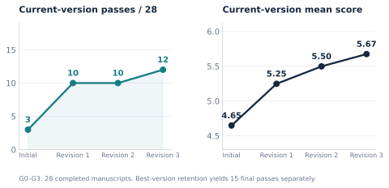

# EAR Technical Report · v6

**Read the result, inspect the evidence, reproduce the arithmetic.**

[English report](reports/EAR_Technical_Report_EN.pdf) ·
[中文报告](reports/EAR_Technical_Report_CN.pdf) ·
[Released data](data/README.md) · [Evaluation protocol](data/protocol.json)

This is the authors' public report package dated October 6, 2026, preserved
byte-for-byte. The repository adds only this page and a [SHA-256 manifest](manifest.json).
The manifest detects accidental changes; it is not an independent authentication
of the research results. The original [package notes](README.txt), editable LaTeX,
figures, aggregate data and build scripts are included.

## Two views of progress



Across the same **28 completed manuscripts**, current-version historical model
assessment passes rise from **3 to 12** over three revisions. Retaining the
best-scoring version gives **15** passes. These are separate quantities. The
fixed manuscript cohort excludes attempts that never produced a manuscript.


In the G3 comparison, the selected strategy uses **9.67 versus 20.5 research
invocations per historical assessor pass (52.8% lower)**. The broader outer
invocation proxy decreases from **43.0 to 24.67 (42.6% lower)**. Each strategy
has four episodes; selected passes are 3/4 and baseline passes are 2/4.
This is an adaptive, unpaired historical comparison, not a matched-task trial.
Both measures omit parts of machine cost, and active human time was not measured.

The full G0–G3 reporting window contains **64 episodes, 630 research invocations,
28 completed manuscripts and 15 selected-best assessor passes**. The window was
selected retrospectively. Whole-population results and the selected-strategy
comparison have different denominators; see the [claim map](data/claims.csv).

## Verify in seconds, without a model

From the repository root, using Python 3.10 or newer:

```bash
python3 scripts/check_report.py
```

This verifies every original file against the manifest and independently runs
the released recomputation script, comparing its output with the packaged
`data/derived_metrics.json`. It does not alter the package or call a model.

To inspect all recomputed metrics directly:

```bash
python3 docs/technical-report/v6/scripts/recompute.py
```

The released aggregates support arithmetic reproduction of the tables, not a
rerun of the original research campaigns. Individual manuscripts, assessor
reviews and evaluator predictions are not distributed. In particular, reported
evaluator F1 values are preserved aggregate inputs, not independently reestimated
from labels and predictions.

## Historical results and the current engine

The report's historical pass rule is **at least one Accept verdict among three
fresh assessment sessions**, with the highest mean-scoring manuscript version
retained. The [current portable engine](../../../autonomousmath/README.md) requires
accepting verdicts from **both independent terminal-review sessions** on the
same artifact version. Its offline fixtures do not count as research acceptance.
The historical pass counts are not results under this newer terminal gate.

A stricter diagnostic applied to the retained G3 historical votes finds **1/4
for each strategy** when all three verdicts must be Accept and each score at
least 7. This was a reclassification of retained votes, not a new review; it is
also not the portable engine's two-session gate. All definitions are in
[protocol.json](data/protocol.json).

## Rebuild the presentation

The shipped PDF, PNG and SVG files are ready to read. To experiment with figures
or rebuild PDFs, work on a copy of this versioned package: modified files will
no longer match its manifest.

```bash
cd docs/technical-report/v6
python3 -m pip install -r requirements.txt
python3 scripts/draw_figures.py
python3 scripts/build_reports.py
```

Plotting requires Matplotlib and a CJK font. PDF compilation also requires
XeLaTeX and the TeX packages/fonts listed in [README.txt](README.txt). These
optional presentation dependencies are unnecessary for numerical verification.
